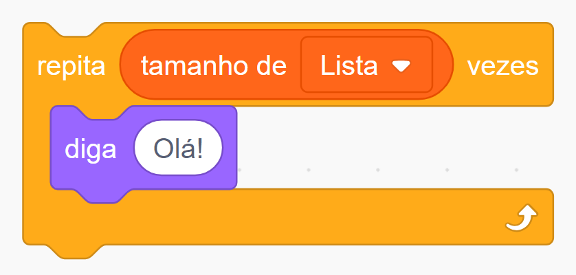
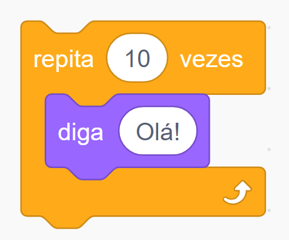

<!-- _class: dark cover -->

# Loop For

Explorando o laço de repetição `for` em detalhes

---

<!-- _class: center -->

# Conceito

O loop `for` permite executar um bloco de código repetidamente por um número definido de vezes, que pode ser determinado antes da execução do loop. Ele é extremamente útil quando sabemos exatamente quantas vezes queremos que um bloco de instruções seja executado.

---

# Sintaxe

A estrutura básica de um loop `for` em Python é simples:

```python
for variavel in colecao:
  # Bloco de código a ser repetido
```

- **`variavel`:** Recebe cada item da coleção, um de cada vez
- **`colecao`:** A sequência sobre a qual o loop está iterando

---

<!-- _class: center -->

# Scratch



---

# Exemplo Prático

Digamos que o professor precisa fazer um código que faça a chamada

```python
# Lista de alunos
alunos = ["João", "Maria", "Roberto", "Letícia"]

# Iterando sobre a lista
for aluno in alunos:
  print(aluno, "está presente?")
```

Este exemplo demonstra como o loop `for` passa por cada elemento da lista `alunos` e executa a função `print()` para cada um

---

# Função `range()`

A função `range()` gera uma sequência numérica, tornando-se muito útil com o loop `for` para repetições baseadas em número de vezes

```python
# Contando até 10
for numero in range(1, 11):
  print(numero)
```

Este código irá imprimir de 1 a 10, demonstrando a eficácia do loop `for` para controlar repetições de tarefas simples

---

<!-- _class: center -->

# Scratch


